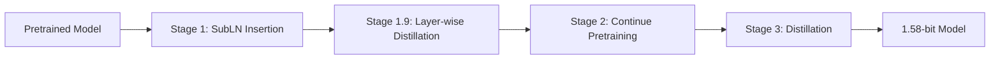

# WrinkleFree-1.58Quant

BitNet 1.58-bit LLM training and serving framework implementing the [BitDistill](https://arxiv.org/abs/2510.13998) approach.

## Overview

WrinkleFree trains language models with **1.58-bit (ternary) weights** {-1, 0, 1}, achieving up to 10x memory savings and 2.65x faster CPU inference while maintaining performance comparable to full-precision models.

### Key Features

- **4-Stage Training Pipeline**: SubLN insertion, layer-wise distillation, continue pretraining, distillation fine-tuning
- **BitDistill Loss**: Combined cross-entropy + logits KL divergence + attention distillation
- **Memory Efficient**: 8-bit AdamW, FSDP sharding, activation checkpointing
- **Flexible Configuration**: Hydra-based configs for models, training stages, and distributed settings
- **Optimized Inference**: Export to GGUF format for microsoft/BitNet serving

For detailed system design, see [Architecture Documentation](docs/architecture.md).
For reproduction steps, see [Experiments](docs/experiments.md).
For API reference, see [API Documentation](docs/api/index.md).

## Installation

```bash
# Clone with BitNet submodule
git clone --recurse-submodules https://github.com/yourrepo/WrinkleFree-1.58Quant.git
cd WrinkleFree-1.58Quant

# Install dependencies
uv sync

# Install with dev dependencies
uv sync --all-extras
```

## Quick Start: Qwen3-4B

Train Qwen3-4B with 1.58-bit quantization using self-distillation:

```bash
# Stage 1: Insert SubLN modules into pretrained model
uv run python scripts/train.py \
    model=qwen3_4b \
    training=stage1_subln \
    distributed=single_gpu

# Stage 1.9 (optional): Layer-wise distillation to align hidden states
uv run python scripts/train.py \
    model=qwen3_4b \
    training=stage1_9_layerwise \
    data=fineweb \
    distributed=single_gpu

# Stage 2: Continue pretraining to adapt weight distributions
uv run python scripts/train.py \
    model=qwen3_4b \
    training=stage2_pretrain \
    data=fineweb \
    distributed=fsdp_multi

# Stage 3: Self-distillation with Qwen3-4B as teacher
uv run python scripts/train.py \
    model=qwen3_4b \
    training=stage3_distill \
    data=downstream \
    distillation=classification \
    distributed=fsdp_multi
```

### Qwen3-4B Memory Requirements

| Stage | GPU Memory | Batch Size | Seq Length |
|-------|------------|------------|------------|
| Stage 1 | ~12 GB | 8 | 1024 |
| Stage 1.9 | ~18 GB | 16 | 512 |
| Stage 2 | ~20 GB | 4 | 1024 |
| Stage 3 | ~24 GB | 4 | 1024 |

---

## Quick Start: SmolLM2-135M (Single GPU)

The SmolLM2-135M model is ideal for getting started with single GPU training:

```bash
# Stage 1: Insert SubLN modules into pretrained model
uv run python scripts/train.py \
    model=smollm2_135m \
    training=stage1_subln \
    distributed=single_gpu

# Stage 2: Continue pretraining to adapt weight distributions (~10B tokens)
uv run python scripts/train.py \
    model=smollm2_135m \
    training=stage2_pretrain \
    data=fineweb \
    distributed=single_gpu

# Stage 3: Distillation fine-tuning with teacher guidance
uv run python scripts/train.py \
    model=smollm2_135m \
    training=stage3_distill_smollm2 \
    data=downstream \
    distillation=classification \
    distributed=single_gpu
```

### SmolLM2-135M Memory Requirements

| Stage | GPU Memory | Batch Size | Seq Length |
|-------|------------|------------|------------|
| Stage 1 | ~8 GB | 16 | 1024 |
| Stage 2 | ~12 GB | 8 | 1024 |
| Stage 3 | ~16 GB | 8 | 1024 |

For GPUs with limited memory, reduce `batch_size` or `max_seq_length` via Hydra overrides:

```bash
uv run python scripts/train.py \
    model=smollm2_135m \
    training=stage3_distill_smollm2 \
    training.batch_size=4 \
    training.max_seq_length=512 \
    distributed=single_gpu
```

## Training Pipeline

WrinkleFree implements the 4-stage BitDistill training approach, with optional CheaperTraining integration for influence-based data selection.



### Stage 1: SubLN Insertion

Modifies a pretrained model by:
1. Replacing `nn.Linear` with `BitLinear` (quantized linear layer)
2. Inserting `SubLN` (RMSNorm) before output projections in attention and FFN

This stage is fast (no training, just architecture modification) and produces an initial checkpoint:

```bash
uv run python scripts/train.py training=stage1_subln model=smollm2_135m
```

**Output**: `outputs/bitdistill_<model>_subln_insertion/stage1_checkpoint/`

---

### Stage 1.9: Layer-wise Distillation (Optional)

Aligns BitNet hidden states with the original full-precision teacher model at each transformer layer. This lightweight stage (~100M tokens) helps reduce distribution shift before heavy Stage 2 pre-training.

**Key Features:**
- **Loss metrics**: MSE normalized (default), cosine, MSE, KL divergence, inner product
- **Layer weighting**: Progressive (later layers weighted more), uniform, exponential, or custom
- **Research basis**: [OneBit](https://arxiv.org/abs/2402.11295) (L2-normalized MSE), [BitDistill](https://arxiv.org/abs/2510.13998) (layer importance)

```bash
uv run python scripts/train.py \
    training=stage1_9_layerwise \
    model=smollm2_135m \
    data=fineweb
```

**Configuration options:**
```yaml
# configs/training/stage1_9_layerwise.yaml
layerwise:
  loss_type: mse_normalized  # cosine, mse, kl, inner_product
  layer_weights: progressive  # null (uniform), exponential, or custom list
  normalize: true
```

**Output**: `outputs/bitdistill_<model>_layerwise_distillation/`

---

### Stage 2: Continue Pretraining

Adapts weight distributions for ternary quantization by training on ~10B tokens:

- **Standard LM Loss**: Next-token prediction on large corpus
- **Quantization Warmup**: Linear schedule that gradually introduces quantization (lambda: 0 → 1)
- **Purpose**: Prepares weights for efficient ternary {-1, 0, 1} representation

```bash
uv run python scripts/train.py \
    training=stage2_pretrain \
    model=smollm2_135m \
    data=fineweb \
    training.total_tokens=10000000000
```

**Quantization Warmup Schedule**:
```
Step 0-1000:    lambda = step/1000 (linear warmup)
Step 1000+:     lambda = 1.0 (full quantization)
```

**CheaperTraining Integration**: During Stage 2, if `influence.enabled=true` in config, the optimizer is wrapped with `InfluenceAwareOptimizer` to perform influence-based data selection:

```yaml
# configs/training/stage2_pretrain.yaml
influence:
  enabled: true
  update_interval: 1000  # Update mixture weights every N steps
  learning_rate: 0.2
  config:
    lambda_val: 0.1
    gamma_val: 0.1
    temperature: 1.0
```

**Output**: `outputs/bitdistill_<model>_continue_pretrain/stage2_checkpoint/`

---

### Stage 3: Distillation Fine-Tuning

Fine-tunes with knowledge distillation from the full-precision teacher model.

#### Loss Function

```
L = L_CE + λ * L_LD + γ * L_AD
```

| Component | Description | Default Weight |
|-----------|-------------|----------------|
| `L_CE` | Cross-entropy loss on target tokens | 1.0 |
| `L_LD` | KL divergence on logits (temperature-scaled) | λ = 10.0 |
| `L_AD` | MiniLM-style attention distribution distillation | γ = 1e-5 |

#### Task-Specific Coefficients

| Task | λ (logits) | γ (attention) | Temperature |
|------|------------|---------------|-------------|
| Classification | 10.0 | 1e-5 | 5.0 |
| Summarization | 1.0 | 1e-3 | 5.0 |

#### Running Stage 3

```bash
# With default settings
uv run python scripts/train.py \
    training=stage3_distill \
    model=smollm2_135m \
    data=downstream

# With custom distillation coefficients
uv run python scripts/train.py \
    training=stage3_distill \
    model=smollm2_135m \
    distillation.lambda_logits=5.0 \
    distillation.gamma_attention=1e-4
```

**CheaperTraining Integration**: Stage 3 also supports influence-aware training via `influence.enabled=true` in the config. This wraps the optimizer to dynamically adjust dataset mixture weights based on gradient-based influence scores.

**Output**: `outputs/bitdistill_<model>_distillation/`

---

### CheaperTraining Integration

[CheaperTraining](https://github.com/your-org/WrinkleFree-CheaperTraining) provides influence-based data selection for more efficient training.

#### Architecture

```
┌─────────────────────────────────────────────────┐
│                   Trainer                        │
│  ┌─────────────────────────────────────────────┐│
│  │         InfluenceAwareOptimizer             ││
│  │  ┌─────────────┐  ┌───────────────────────┐ ││
│  │  │ AdamW       │  │ MixtureWeightCalculator│ ││
│  │  │ (base opt)  │  │                       │ ││
│  │  └─────────────┘  │  ┌─────────────────┐  │ ││
│  │                   │  │ DataInfCalculator│  │ ││
│  │                   │  └─────────────────┘  │ ││
│  │                   └───────────────────────┘ ││
│  └─────────────────────────────────────────────┘│
└─────────────────────────────────────────────────┘
```

#### How It Works

1. **DataInfCalculator**: Computes per-sample influence scores via gradient analysis
2. **MixtureWeightCalculator**: Converts influence scores to dataset mixture weights
3. **InfluenceAwareOptimizer**: Wraps base optimizer, updates weights every N steps
4. **MixedDataset**: Samples from multiple data sources based on mixture weights

#### Configuration

```yaml
# In stage2_pretrain.yaml or stage3_distill.yaml
influence:
  enabled: true
  update_interval: 1000    # Steps between weight updates
  learning_rate: 0.2       # Learning rate for weight updates
  config:
    lambda_val: 0.1        # Regularization for influence calc
    gamma_val: 0.1         # Decay factor
    temperature: 1.0       # Softmax temperature for weights
```

#### Installation

CheaperTraining is installed as a local dependency:

```bash
# In pyproject.toml
cheapertraining @ file:///path/to/WrinkleFree-CheaperTraining
```

Or install separately:

```bash
pip install -e /path/to/WrinkleFree-CheaperTraining
```

## Multi-GPU Training

For larger models, use FSDP distributed training:

```bash
# Multi-GPU with FSDP
uv run torchrun --nproc_per_node=4 scripts/train.py \
    model=llama_7b \
    training=stage3_distill \
    distributed=fsdp_multi

# Large-scale (8+ GPUs)
uv run torchrun --nproc_per_node=8 scripts/train.py \
    model=llama_7b \
    training=stage3_distill \
    distributed=fsdp_large
```

## Available Models

| Model | Parameters | Config | Use Case |
|-------|------------|--------|----------|
| **Qwen3-4B** | 4B | `model=qwen3_4b` | Recommended, efficient training |
| SmolLM2-135M | 135M | `model=smollm2_135m` | Single GPU training, testing |
| LLaMA-3B | 3B | `model=llama_3b` | Development, moderate GPU |
| LLaMA-7B | 7B | `model=llama_7b` | Production, multi-GPU |
| Qwen-7B | 7B | `model=qwen_7b` | Alternative architecture |

## Serving

After training, export to GGUF format for optimized inference:

```bash
# Convert to GGUF
uv run python scripts/convert_to_gguf.py \
    --input outputs/checkpoint-final \
    --output outputs/model.gguf

# Serve with BitNet.cpp
uv run python scripts/serve.py --model outputs/model.gguf --port 8080
```

## Configuration Reference

For a detailed guide on how to choose models, stages, and hardware settings, see the [Configuration Guide](docs/configuration_guide.md).

All configs use [Hydra](https://hydra.cc/) and are located in `configs/`:

```
configs/
├── config.yaml          # Main entry point
├── model/               # Model architectures
│   ├── smollm2_135m.yaml
│   ├── llama_3b.yaml
│   ├── llama_7b.yaml
│   └── qwen_7b.yaml
├── training/            # Training stage configs
│   ├── stage1_subln.yaml
│   ├── stage1_9_layerwise.yaml
│   ├── stage2_pretrain.yaml
│   ├── stage3_distill.yaml
│   └── stage3_distill_smollm2.yaml
├── data/                # Dataset configs
│   ├── falcon.yaml
│   ├── fineweb.yaml
│   └── downstream.yaml
├── distributed/         # Distributed training
│   ├── single_gpu.yaml
│   ├── fsdp_multi.yaml
│   └── fsdp_large.yaml
└── distillation/        # Loss coefficients
    ├── classification.yaml
    └── summarization.yaml

benchmark/config/        # Ax optimization configs
├── benchmark.yaml       # Runner settings (trials, steps, etc.)
└── search_space.yaml    # Parameter search space
```

Override any config value via command line:

```bash
uv run python scripts/train.py \
    model=smollm2_135m \
    training.lr=5e-5 \
    training.batch_size=16 \
    model.quantization.activation_bits=8
```

## Project Structure

```
src/wrinklefree/
├── models/
│   ├── bitlinear.py      # BitLinear with STE quantization
│   ├── subln.py          # SubLN normalization
│   ├── attention.py      # Multi-head attention with RoPE + GQA
│   ├── ffn.py            # FFN with ReLU^2
│   └── llama.py          # LLaMA-style architecture
├── quantization/
│   ├── weight_quant.py   # Ternary {-1, 0, 1} quantization
│   ├── activation_quant.py # 8-bit per-token quantization
│   └── ste.py            # Straight-through estimator
├── distillation/
│   ├── logits_loss.py    # KL divergence on logits
│   ├── attention_loss.py # Attention distribution distillation
│   ├── layerwise_loss.py # Layer-wise hidden state distillation (Stage 1.9)
│   └── combined_loss.py  # BitDistill combined loss
├── training/
│   ├── fsdp_wrapper.py   # FSDP + activation checkpointing
│   ├── trainer.py        # Main training loop
│   ├── stage1.py         # SubLN insertion
│   ├── stage1_9.py       # Layer-wise distillation
│   ├── stage2.py         # Continue pretraining
│   └── stage3.py         # Distillation fine-tuning
├── data/
│   ├── pretrain_dataset.py   # Streaming corpus loader
│   └── finetune_dataset.py   # Downstream task datasets
├── serving/
│   ├── converter.py      # PyTorch -> GGUF conversion
│   └── bitnet_wrapper.py # BitNet.cpp Python client
└── utils/
    ├── run_fingerprint.py  # Config + git fingerprinting
    ├── run_manager.py      # GCS checkpoint management
    ├── audit_logger.py     # Persistent warning logs
    └── checkpoint.py

training_logs/             # Committed audit logs (NOT in .gitignore)
└── warnings/              # Warning JSON files for audit trail

benchmark/                # Ax Bayesian optimization
├── core/
│   ├── metrics.py        # BenchmarkMetrics dataclass
│   ├── runner.py         # Short trial executor
│   └── memory.py         # GPU memory tracking
├── optimization/
│   └── ax_client.py      # Ax Service API wrapper
├── analysis/
│   └── report.py         # Result analysis & visualization
└── config/
    ├── benchmark.yaml    # Runner configuration
    └── search_space.yaml # Parameter search space
```

## Testing

```bash
# Run all tests
uv run pytest

# Run with coverage
uv run pytest --cov=src/wrinklefree

# Run specific test file
uv run pytest tests/test_bitlinear.py -v
```

## Sequence Packing

WrinkleFree uses FlashAttention-based sequence packing for efficient pretraining. Multiple documents are concatenated with EOS tokens, and `position_ids` reset at each document boundary.

**Benefits:**
- Minimizes padding waste (documents fully utilize context length)
- Processes more tokens per batch
- ~20-30% training speedup on typical datasets

**How it works:**
```
Document 1: [A, B, C, EOS]  Document 2: [D, E, EOS]  Document 3: [F, G, H, I, EOS]
Packed:     [A, B, C, EOS, D, E, EOS, F, G, H, I, EOS, ...]
Positions:  [0, 1, 2,  3,  0, 1,  2,  0, 1, 2, 3,  4, ...]
```

Position IDs reset after each EOS token, so RoPE treats each document as starting from position 0. This prevents cross-document attention contamination.

**Configuration:**
```yaml
# configs/training/stage2_pretrain.yaml
packing:
  enabled: true  # Default on
```

Reference: [LLM Sequence Packing](https://huggingface.co/blog/sirluk/llm-sequence-packing)

## Memory Optimization Tips

1. **8-bit AdamW**: Enabled by default via bitsandbytes
2. **Activation Checkpointing**: Recomputes activations during backward pass
3. **Gradient Accumulation**: Increase `gradient_accumulation_steps` for larger effective batch size
4. **Mixed Precision**: BFloat16 training enabled by default
5. **Teacher CPU Offload**: For Stage 3, teacher model can be offloaded to CPU between forward passes
6. **Sequence Packing**: Enabled by default, reduces padding waste

## Run Fingerprinting & Auto-Resume

WrinkleFree includes automatic run detection and resumption based on config + git state fingerprinting. This prevents duplicate runs and enables seamless recovery from interruptions.

### How It Works

1. **Fingerprint Generation**: SHA256 hash of cleaned config (math-affecting params only) + git commit
2. **GCS Integration**: Stores metadata at `gs://bucket/experiments/{fingerprint}/metadata.json`
3. **Auto-Resume**: Detects interrupted runs and downloads checkpoints automatically
4. **Audit Logging**: Warnings logged to `training_logs/warnings/` (committed to git)

### Configuration

```yaml
# In configs/config.yaml
gcs:
  enabled: true  # Enable GCS-based checkpointing
  bucket: wrinklefree-checkpoints
  experiment_prefix: experiments

resume:
  skip_completed: true  # Skip already-completed runs
```

### Usage

```bash
# Normal training (with auto-resume enabled)
uv run python scripts/train.py model=smollm2_135m training=stage2_pretrain

# Skip auto-resume (start fresh)
uv run python scripts/train.py model=smollm2_135m training=stage2_pretrain +skip_recovery=true
```

### GCS Credentials

Set up Google Cloud credentials before using GCS features:

```bash
# Option 1: Service account key
export GOOGLE_APPLICATION_CREDENTIALS=/path/to/service-account.json

# Option 2: gcloud auth (for local development)
gcloud auth application-default login
```

**IMPORTANT**: If GCS is enabled but credentials are missing, training will **FAIL LOUDLY** (abort). This is intentional to prevent silent failures and lost work.

### Dirty Git Warnings

Training with uncommitted changes triggers a **LOUD warning** and creates an audit log entry in `training_logs/warnings/`. This ensures reproducibility issues are documented.

```
XXXXXXXXXXXXXXXXXXXXXXXXXXXXXXXXXXXXXXXXXXXXXXXXXXXXXXXXXXXXXXXXXXXXXXXX
XXX CRITICAL: DIRTY GIT
XXX fingerprint: a3f7c2d1...
XXX git_commit: def456...
XXX message: Training with uncommitted changes - results may not be reproducible
XXXXXXXXXXXXXXXXXXXXXXXXXXXXXXXXXXXXXXXXXXXXXXXXXXXXXXXXXXXXXXXXXXXXXXXX
```

### Fingerprint Keys

Infrastructure-only keys are **excluded** from fingerprinting (changes don't affect run identity):

- `num_workers`, `output_dir`, `logging.*`
- `checkpoint.save_interval`, `checkpoint.resume_from`
- `gcs.*`, `resume.*`, `audit.*`

Changes to model architecture, learning rates, batch sizes, etc. **do** affect the fingerprint.

## Hyperparameter Optimization with Ax

WrinkleFree includes an Ax Bayesian optimization benchmark to find optimal training configurations for efficiency (tokens/sec per GB memory).

### Installation

```bash
# Install benchmark dependencies
uv sync --extra benchmark
```

### Quick Start

```bash
# Run optimization with default settings (50 trials, ~3-4 hours)
uv run python scripts/run_benchmark.py

# Run with fewer trials for quick testing
uv run python scripts/run_benchmark.py benchmark.num_trials=10

# Resume from saved experiment
uv run python scripts/run_benchmark.py --resume benchmark_results/experiment.json

# Analyze existing results only (no new trials)
uv run python scripts/run_benchmark.py --analyze-only benchmark_results/experiment.json
```

### Search Space

The optimization explores Stage 2 (continue pretraining) parameters with Muon optimizer:

| Category | Parameters |
|----------|------------|
| **Training** | `learning_rate` (1e-4 to 1e-2), `gradient_accumulation_steps` (1-8), `weight_decay` (0.01-0.2), `warmup_steps` (500-2000) |
| **Influence** | `influence_enabled`, `influence_lambda_reg` |

Note: Optimizer is fixed to Muon for all trials.

### Configuration

Customize via Hydra overrides or edit `benchmark/config/benchmark.yaml`:

```bash
# Change number of measurement steps
uv run python scripts/run_benchmark.py benchmark.measurement_steps=200

# Use different sequence length
uv run python scripts/run_benchmark.py benchmark.sequence_length=1024

# Disable synthetic data (use real dataset)
uv run python scripts/run_benchmark.py benchmark.use_synthetic_data=false
```

### Output

Results are saved to `benchmark_results/`:

```
benchmark_results/
├── experiment.json      # Ax experiment state (for resuming)
├── analysis.json        # Analysis results
├── report.md            # Markdown report
└── plots/
    ├── optimization_trace.png
    ├── optimizer_comparison.png
    └── parameter_importance.png
```

Example output:
```
=== Best Configuration ===
  optimizer_type: muon
  learning_rate: 3.2e-3
  batch_size: 32
  lambda_logits: 8.5
  influence_enabled: true

  Performance: 1,847 tokens/sec/GB

=== Optimizer Comparison ===
  muon:        avg=1,653 tok/s/GB, mem=5.80 GB (12 trials)
  adamw_8bit:  avg=1,412 tok/s/GB, mem=6.20 GB (10 trials)
  apollo:      avg=1,580 tok/s/GB, mem=4.90 GB (8 trials)
```

### Optimizer Notes

- **Muon** (default): 2x sample efficiency vs AdamW, lighter memory footprint ([paper](https://arxiv.org/abs/2502.16982))
- **AdamW 8-bit**: Memory efficient via bitsandbytes
- **Apollo**: 1/8 memory of AdamW ([paper](https://arxiv.org/abs/2412.05270))
- **Apollo-Mini**: Extreme memory efficiency (1/1024 of AdamW)

To override the optimizer, use Hydra overrides:
```bash
uv run python scripts/train.py model=qwen3_4b optimizer.type=adamw_8bit
```

## References

- [BitDistill: Unleashing the Potential of Sub-4-Bit LLMs via Self-Distillation](https://arxiv.org/abs/2510.13998)
- [Microsoft BitNet](https://github.com/microsoft/BitNet)
- [SmolLM2](https://huggingface.co/collections/HuggingFaceTB/smollm2-6723884218bcda64b34d7db9)

## License

MIT
